# Agent Orchestration Map

Auto-generated by `scripts/generate_orchestration_map.py`. Do not edit by hand.

`Type` = `agent_type`. `Coordinates` = `coordinated_agents` (delegation edges). `Extends` = base agent via `extends` (policy overlay).

| Agent | Type | Coordinates | Extends |
|-------|------|-------------|---------|
| `artificial-lift-agent` | community-agent | — | — |
| `asset-economics-agent` | community-coordinator | `reservoir-to-facility-screening-agent` | — |
| `cfd-coupling-agent` | community-agent | `flow-assurance-engineer-agent`, `fem-coupling-agent` | — |
| `community-router-agent` | community-coordinator | `artificial-lift-agent`, `asset-economics-agent`, `cfd-coupling-agent`, `compressor-antisurge-agent`, `concept-selection-agent`, `debottlenecking-agent`, `dynamic-instrument-controller-agent`, `dynamic-process-preparation-agent`, `e300-fluid-agent`, `emissions-abatement-screening-agent`, `energy-emissions-agent`, `fem-coupling-agent`, `field-development-economics-agent`, `flow-assurance-engineer-agent`, `flow-assurance-study-agent`, `fluid-characterization-agent`, `gas-export-pipeline-agent`, `gas-lift-allocation-agent`, `gas-treatment-agent`, `gas-turbine-screening-agent`, `hydrate-screening-agent`, `ncs-production-analysis-agent`, `near-well-injectivity-agent`, `noise-assessment-agent`, `olga-simulation-agent`, `pipe-route-screening-agent`, `pipeline-survey-profile-agent`, `piping-integrity-agent`, `piping-mechanical-agent`, `process-engineer-agent`, `process-safety-agent`, `process-screening-agent`, `produced-water-scale-agent`, `production-optimization-agent`, `pvt-agent`, `reciprocating-compressor-agent`, `reservoir-forecasting-agent`, `reservoir-simulator-agent`, `reservoir-to-facility-screening-agent`, `resource-classification-agent`, `sand-erosion-agent`, `subsea-cooldown-agent`, `subsea-layout-screening-agent`, `surf-layout-design-agent`, `technical-document-intelligence-agent`, `teg-dehydration-agent`, `tie-in-screening-agent`, `utilities-screening-agent` | — |
| `compressor-antisurge-agent` | community-agent | — | — |
| `concept-selection-agent` | community-agent | — | — |
| `debottlenecking-agent` | community-agent | — | — |
| `dynamic-instrument-controller-agent` | community-agent | — | — |
| `dynamic-process-preparation-agent` | community-agent | — | — |
| `e300-fluid-agent` | community-agent | — | — |
| `emissions-abatement-screening-agent` | community-coordinator | `energy-emissions-agent`, `ncs-production-analysis-agent`, `concept-selection-agent`, `asset-economics-agent` | — |
| `energy-emissions-agent` | community-agent | — | — |
| `fem-coupling-agent` | community-agent | `cfd-coupling-agent`, `subsea-cooldown-agent`, `flow-assurance-engineer-agent`, `piping-mechanical-agent` | — |
| `field-development-economics-agent` | community-coordinator | `asset-economics-agent`, `reservoir-to-facility-screening-agent` | — |
| `flow-assurance-engineer-agent` | community-coordinator | `olga-simulation-agent`, `flow-assurance-study-agent` | — |
| `flow-assurance-study-agent` | community-coordinator | `technical-document-intelligence-agent`, `pvt-agent`, `pipe-route-screening-agent`, `flow-assurance-engineer-agent`, `olga-simulation-agent`, `subsea-cooldown-agent`, `piping-integrity-agent`, `sand-erosion-agent` | — |
| `fluid-characterization-agent` | community-agent | — | — |
| `gas-export-pipeline-agent` | community-agent | — | — |
| `gas-lift-allocation-agent` | community-agent | — | — |
| `gas-treatment-agent` | community-agent | — | — |
| `gas-turbine-screening-agent` | community-agent | — | — |
| `hydrate-screening-agent` | community-agent | — | — |
| `ncs-production-analysis-agent` | community-coordinator | `reservoir-to-facility-screening-agent`, `concept-selection-agent`, `asset-economics-agent` | — |
| `near-well-injectivity-agent` | community-agent | `reservoir-simulator-agent`, `flow-assurance-engineer-agent` | — |
| `noise-assessment-agent` | community-agent | — | — |
| `olga-simulation-agent` | community-coordinator | `flow-assurance-engineer-agent`, `flow-assurance-study-agent`, `pipe-route-screening-agent`, `subsea-cooldown-agent`, `pvt-agent` | — |
| `pipe-route-screening-agent` | community-coordinator | `flow-assurance-engineer-agent`, `subsea-layout-screening-agent` | — |
| `pipeline-survey-profile-agent` | community-agent | `pipe-route-screening-agent`, `subsea-layout-screening-agent`, `flow-assurance-engineer-agent` | — |
| `piping-integrity-agent` | community-agent | — | — |
| `piping-mechanical-agent` | community-agent | — | — |
| `process-engineer-agent` | community-agent | — | — |
| `process-safety-agent` | community-agent | — | — |
| `process-screening-agent` | community-agent | — | — |
| `produced-water-scale-agent` | community-agent | — | — |
| `production-optimization-agent` | community-agent | — | — |
| `pvt-agent` | community-agent | — | — |
| `reciprocating-compressor-agent` | community-agent | — | — |
| `reservoir-forecasting-agent` | community-coordinator | `ncs-production-analysis-agent`, `reservoir-to-facility-screening-agent`, `asset-economics-agent` | — |
| `reservoir-simulator-agent` | community-coordinator | `reservoir-forecasting-agent`, `reservoir-to-facility-screening-agent`, `fluid-characterization-agent`, `asset-economics-agent`, `near-well-injectivity-agent` | — |
| `reservoir-to-facility-screening-agent` | community-coordinator | `subsea-layout-screening-agent`, `tie-in-screening-agent` | — |
| `resource-classification-agent` | community-agent | — | — |
| `sand-erosion-agent` | community-agent | — | — |
| `subsea-cooldown-agent` | community-agent | — | — |
| `subsea-layout-screening-agent` | community-coordinator | `tie-in-screening-agent` | — |
| `surf-layout-design-agent` | community-coordinator | `reservoir-simulator-agent`, `subsea-layout-screening-agent`, `pipe-route-screening-agent`, `flow-assurance-engineer-agent`, `asset-economics-agent` | — |
| `technical-document-intelligence-agent` | community-agent | — | — |
| `teg-dehydration-agent` | community-agent | — | — |
| `tie-in-screening-agent` | community-agent | — | — |
| `utilities-screening-agent` | community-agent | — | — |

## Delegation graph

```mermaid
graph LR
    asset_economics_agent["asset-economics-agent"] --> reservoir_to_facility_screening_agent["reservoir-to-facility-screening-agent"]
    cfd_coupling_agent["cfd-coupling-agent"] --> flow_assurance_engineer_agent["flow-assurance-engineer-agent"]
    cfd_coupling_agent["cfd-coupling-agent"] --> fem_coupling_agent["fem-coupling-agent"]
    community_router_agent["community-router-agent"] --> artificial_lift_agent["artificial-lift-agent"]
    community_router_agent["community-router-agent"] --> asset_economics_agent["asset-economics-agent"]
    community_router_agent["community-router-agent"] --> cfd_coupling_agent["cfd-coupling-agent"]
    community_router_agent["community-router-agent"] --> compressor_antisurge_agent["compressor-antisurge-agent"]
    community_router_agent["community-router-agent"] --> concept_selection_agent["concept-selection-agent"]
    community_router_agent["community-router-agent"] --> debottlenecking_agent["debottlenecking-agent"]
    community_router_agent["community-router-agent"] --> dynamic_instrument_controller_agent["dynamic-instrument-controller-agent"]
    community_router_agent["community-router-agent"] --> dynamic_process_preparation_agent["dynamic-process-preparation-agent"]
    community_router_agent["community-router-agent"] --> e300_fluid_agent["e300-fluid-agent"]
    community_router_agent["community-router-agent"] --> emissions_abatement_screening_agent["emissions-abatement-screening-agent"]
    community_router_agent["community-router-agent"] --> energy_emissions_agent["energy-emissions-agent"]
    community_router_agent["community-router-agent"] --> fem_coupling_agent["fem-coupling-agent"]
    community_router_agent["community-router-agent"] --> field_development_economics_agent["field-development-economics-agent"]
    community_router_agent["community-router-agent"] --> flow_assurance_engineer_agent["flow-assurance-engineer-agent"]
    community_router_agent["community-router-agent"] --> flow_assurance_study_agent["flow-assurance-study-agent"]
    community_router_agent["community-router-agent"] --> fluid_characterization_agent["fluid-characterization-agent"]
    community_router_agent["community-router-agent"] --> gas_export_pipeline_agent["gas-export-pipeline-agent"]
    community_router_agent["community-router-agent"] --> gas_lift_allocation_agent["gas-lift-allocation-agent"]
    community_router_agent["community-router-agent"] --> gas_treatment_agent["gas-treatment-agent"]
    community_router_agent["community-router-agent"] --> gas_turbine_screening_agent["gas-turbine-screening-agent"]
    community_router_agent["community-router-agent"] --> hydrate_screening_agent["hydrate-screening-agent"]
    community_router_agent["community-router-agent"] --> ncs_production_analysis_agent["ncs-production-analysis-agent"]
    community_router_agent["community-router-agent"] --> near_well_injectivity_agent["near-well-injectivity-agent"]
    community_router_agent["community-router-agent"] --> noise_assessment_agent["noise-assessment-agent"]
    community_router_agent["community-router-agent"] --> olga_simulation_agent["olga-simulation-agent"]
    community_router_agent["community-router-agent"] --> pipe_route_screening_agent["pipe-route-screening-agent"]
    community_router_agent["community-router-agent"] --> pipeline_survey_profile_agent["pipeline-survey-profile-agent"]
    community_router_agent["community-router-agent"] --> piping_integrity_agent["piping-integrity-agent"]
    community_router_agent["community-router-agent"] --> piping_mechanical_agent["piping-mechanical-agent"]
    community_router_agent["community-router-agent"] --> process_engineer_agent["process-engineer-agent"]
    community_router_agent["community-router-agent"] --> process_safety_agent["process-safety-agent"]
    community_router_agent["community-router-agent"] --> process_screening_agent["process-screening-agent"]
    community_router_agent["community-router-agent"] --> produced_water_scale_agent["produced-water-scale-agent"]
    community_router_agent["community-router-agent"] --> production_optimization_agent["production-optimization-agent"]
    community_router_agent["community-router-agent"] --> pvt_agent["pvt-agent"]
    community_router_agent["community-router-agent"] --> reciprocating_compressor_agent["reciprocating-compressor-agent"]
    community_router_agent["community-router-agent"] --> reservoir_forecasting_agent["reservoir-forecasting-agent"]
    community_router_agent["community-router-agent"] --> reservoir_simulator_agent["reservoir-simulator-agent"]
    community_router_agent["community-router-agent"] --> reservoir_to_facility_screening_agent["reservoir-to-facility-screening-agent"]
    community_router_agent["community-router-agent"] --> resource_classification_agent["resource-classification-agent"]
    community_router_agent["community-router-agent"] --> sand_erosion_agent["sand-erosion-agent"]
    community_router_agent["community-router-agent"] --> subsea_cooldown_agent["subsea-cooldown-agent"]
    community_router_agent["community-router-agent"] --> subsea_layout_screening_agent["subsea-layout-screening-agent"]
    community_router_agent["community-router-agent"] --> surf_layout_design_agent["surf-layout-design-agent"]
    community_router_agent["community-router-agent"] --> technical_document_intelligence_agent["technical-document-intelligence-agent"]
    community_router_agent["community-router-agent"] --> teg_dehydration_agent["teg-dehydration-agent"]
    community_router_agent["community-router-agent"] --> tie_in_screening_agent["tie-in-screening-agent"]
    community_router_agent["community-router-agent"] --> utilities_screening_agent["utilities-screening-agent"]
    emissions_abatement_screening_agent["emissions-abatement-screening-agent"] --> energy_emissions_agent["energy-emissions-agent"]
    emissions_abatement_screening_agent["emissions-abatement-screening-agent"] --> ncs_production_analysis_agent["ncs-production-analysis-agent"]
    emissions_abatement_screening_agent["emissions-abatement-screening-agent"] --> concept_selection_agent["concept-selection-agent"]
    emissions_abatement_screening_agent["emissions-abatement-screening-agent"] --> asset_economics_agent["asset-economics-agent"]
    fem_coupling_agent["fem-coupling-agent"] --> cfd_coupling_agent["cfd-coupling-agent"]
    fem_coupling_agent["fem-coupling-agent"] --> subsea_cooldown_agent["subsea-cooldown-agent"]
    fem_coupling_agent["fem-coupling-agent"] --> flow_assurance_engineer_agent["flow-assurance-engineer-agent"]
    fem_coupling_agent["fem-coupling-agent"] --> piping_mechanical_agent["piping-mechanical-agent"]
    field_development_economics_agent["field-development-economics-agent"] --> asset_economics_agent["asset-economics-agent"]
    field_development_economics_agent["field-development-economics-agent"] --> reservoir_to_facility_screening_agent["reservoir-to-facility-screening-agent"]
    flow_assurance_engineer_agent["flow-assurance-engineer-agent"] --> olga_simulation_agent["olga-simulation-agent"]
    flow_assurance_engineer_agent["flow-assurance-engineer-agent"] --> flow_assurance_study_agent["flow-assurance-study-agent"]
    flow_assurance_study_agent["flow-assurance-study-agent"] --> technical_document_intelligence_agent["technical-document-intelligence-agent"]
    flow_assurance_study_agent["flow-assurance-study-agent"] --> pvt_agent["pvt-agent"]
    flow_assurance_study_agent["flow-assurance-study-agent"] --> pipe_route_screening_agent["pipe-route-screening-agent"]
    flow_assurance_study_agent["flow-assurance-study-agent"] --> flow_assurance_engineer_agent["flow-assurance-engineer-agent"]
    flow_assurance_study_agent["flow-assurance-study-agent"] --> olga_simulation_agent["olga-simulation-agent"]
    flow_assurance_study_agent["flow-assurance-study-agent"] --> subsea_cooldown_agent["subsea-cooldown-agent"]
    flow_assurance_study_agent["flow-assurance-study-agent"] --> piping_integrity_agent["piping-integrity-agent"]
    flow_assurance_study_agent["flow-assurance-study-agent"] --> sand_erosion_agent["sand-erosion-agent"]
    ncs_production_analysis_agent["ncs-production-analysis-agent"] --> reservoir_to_facility_screening_agent["reservoir-to-facility-screening-agent"]
    ncs_production_analysis_agent["ncs-production-analysis-agent"] --> concept_selection_agent["concept-selection-agent"]
    ncs_production_analysis_agent["ncs-production-analysis-agent"] --> asset_economics_agent["asset-economics-agent"]
    near_well_injectivity_agent["near-well-injectivity-agent"] --> reservoir_simulator_agent["reservoir-simulator-agent"]
    near_well_injectivity_agent["near-well-injectivity-agent"] --> flow_assurance_engineer_agent["flow-assurance-engineer-agent"]
    olga_simulation_agent["olga-simulation-agent"] --> flow_assurance_engineer_agent["flow-assurance-engineer-agent"]
    olga_simulation_agent["olga-simulation-agent"] --> flow_assurance_study_agent["flow-assurance-study-agent"]
    olga_simulation_agent["olga-simulation-agent"] --> pipe_route_screening_agent["pipe-route-screening-agent"]
    olga_simulation_agent["olga-simulation-agent"] --> subsea_cooldown_agent["subsea-cooldown-agent"]
    olga_simulation_agent["olga-simulation-agent"] --> pvt_agent["pvt-agent"]
    pipe_route_screening_agent["pipe-route-screening-agent"] --> flow_assurance_engineer_agent["flow-assurance-engineer-agent"]
    pipe_route_screening_agent["pipe-route-screening-agent"] --> subsea_layout_screening_agent["subsea-layout-screening-agent"]
    pipeline_survey_profile_agent["pipeline-survey-profile-agent"] --> pipe_route_screening_agent["pipe-route-screening-agent"]
    pipeline_survey_profile_agent["pipeline-survey-profile-agent"] --> subsea_layout_screening_agent["subsea-layout-screening-agent"]
    pipeline_survey_profile_agent["pipeline-survey-profile-agent"] --> flow_assurance_engineer_agent["flow-assurance-engineer-agent"]
    reservoir_forecasting_agent["reservoir-forecasting-agent"] --> ncs_production_analysis_agent["ncs-production-analysis-agent"]
    reservoir_forecasting_agent["reservoir-forecasting-agent"] --> reservoir_to_facility_screening_agent["reservoir-to-facility-screening-agent"]
    reservoir_forecasting_agent["reservoir-forecasting-agent"] --> asset_economics_agent["asset-economics-agent"]
    reservoir_simulator_agent["reservoir-simulator-agent"] --> reservoir_forecasting_agent["reservoir-forecasting-agent"]
    reservoir_simulator_agent["reservoir-simulator-agent"] --> reservoir_to_facility_screening_agent["reservoir-to-facility-screening-agent"]
    reservoir_simulator_agent["reservoir-simulator-agent"] --> fluid_characterization_agent["fluid-characterization-agent"]
    reservoir_simulator_agent["reservoir-simulator-agent"] --> asset_economics_agent["asset-economics-agent"]
    reservoir_simulator_agent["reservoir-simulator-agent"] --> near_well_injectivity_agent["near-well-injectivity-agent"]
    reservoir_to_facility_screening_agent["reservoir-to-facility-screening-agent"] --> subsea_layout_screening_agent["subsea-layout-screening-agent"]
    reservoir_to_facility_screening_agent["reservoir-to-facility-screening-agent"] --> tie_in_screening_agent["tie-in-screening-agent"]
    subsea_layout_screening_agent["subsea-layout-screening-agent"] --> tie_in_screening_agent["tie-in-screening-agent"]
    surf_layout_design_agent["surf-layout-design-agent"] --> reservoir_simulator_agent["reservoir-simulator-agent"]
    surf_layout_design_agent["surf-layout-design-agent"] --> subsea_layout_screening_agent["subsea-layout-screening-agent"]
    surf_layout_design_agent["surf-layout-design-agent"] --> pipe_route_screening_agent["pipe-route-screening-agent"]
    surf_layout_design_agent["surf-layout-design-agent"] --> flow_assurance_engineer_agent["flow-assurance-engineer-agent"]
    surf_layout_design_agent["surf-layout-design-agent"] --> asset_economics_agent["asset-economics-agent"]
```

