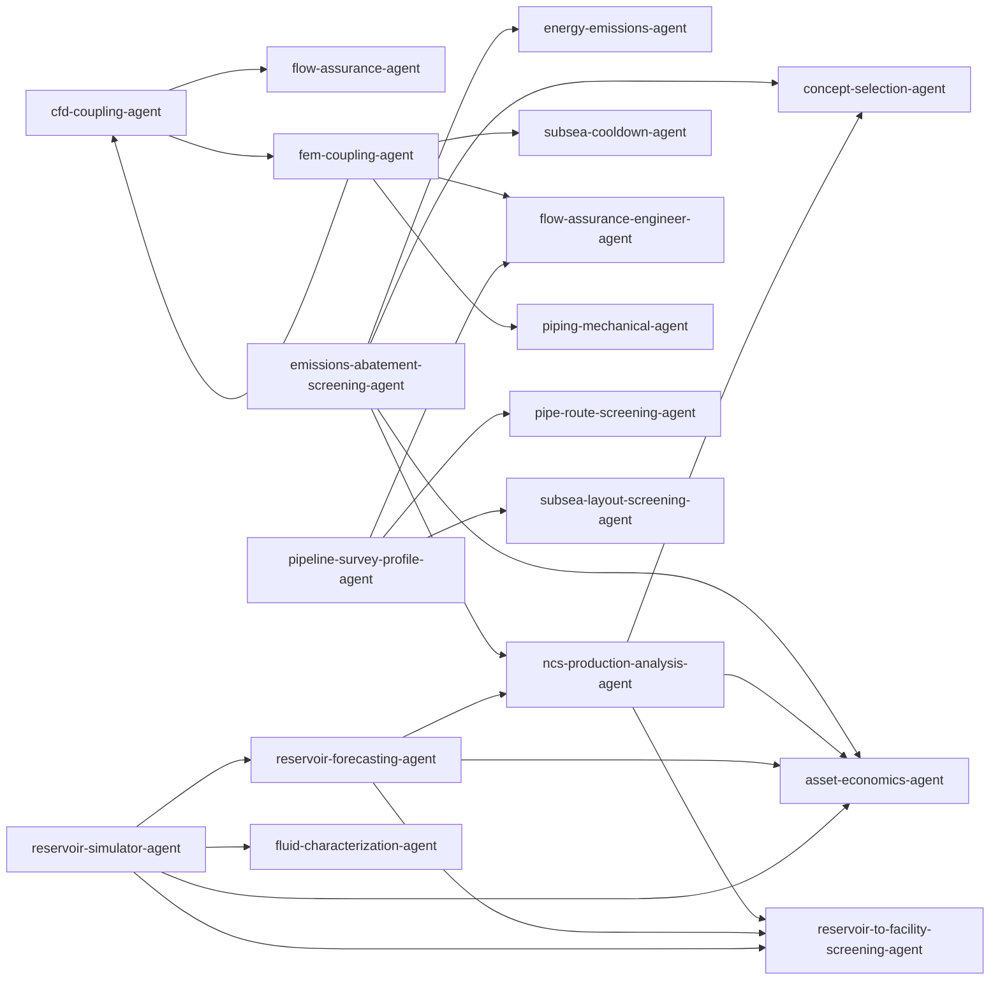

# Agent Orchestration Map

Auto-generated by `scripts/generate_orchestration_map.py`. Do not edit by hand.

`Type` = `agent_type`. `Coordinates` = `coordinated_agents` (delegation edges). `Extends` = base agent via `extends` (policy overlay).

| Agent | Type | Coordinates | Extends |
|-------|------|-------------|---------|
| `artificial-lift-agent` | — | — | — |
| `asset-economics-agent` | — | — | — |
| `cfd-coupling-agent` | community-agent | `flow-assurance-agent`, `fem-coupling-agent` | — |
| `compressor-antisurge-agent` | — | — | — |
| `concept-selection-agent` | — | — | — |
| `debottlenecking-agent` | — | — | — |
| `dynamic-instrument-controller-agent` | — | — | — |
| `dynamic-process-preparation-agent` | — | — | — |
| `e300-fluid-agent` | — | — | — |
| `emissions-abatement-screening-agent` | community-coordinator | `energy-emissions-agent`, `ncs-production-analysis-agent`, `concept-selection-agent`, `asset-economics-agent` | — |
| `energy-emissions-agent` | — | — | — |
| `fem-coupling-agent` | community-agent | `cfd-coupling-agent`, `subsea-cooldown-agent`, `flow-assurance-engineer-agent`, `piping-mechanical-agent` | — |
| `field-development-economics-agent` | — | — | — |
| `flow-assurance-engineer-agent` | — | — | — |
| `fluid-characterization-agent` | — | — | — |
| `gas-export-pipeline-agent` | — | — | — |
| `gas-lift-allocation-agent` | — | — | — |
| `gas-treatment-agent` | — | — | — |
| `gas-turbine-screening-agent` | — | — | — |
| `hydrate-screening-agent` | — | — | — |
| `ncs-production-analysis-agent` | community-coordinator | `reservoir-to-facility-screening-agent`, `concept-selection-agent`, `asset-economics-agent` | — |
| `pipe-route-screening-agent` | — | — | — |
| `pipeline-survey-profile-agent` | community-agent | `pipe-route-screening-agent`, `subsea-layout-screening-agent`, `flow-assurance-engineer-agent` | — |
| `piping-integrity-agent` | — | — | — |
| `piping-mechanical-agent` | — | — | — |
| `process-engineer-agent` | — | — | — |
| `process-safety-agent` | — | — | — |
| `process-screening-agent` | — | — | — |
| `produced-water-scale-agent` | — | — | — |
| `production-optimization-agent` | — | — | — |
| `pvt-agent` | — | — | — |
| `reciprocating-compressor-agent` | — | — | — |
| `reservoir-forecasting-agent` | community-coordinator | `ncs-production-analysis-agent`, `reservoir-to-facility-screening-agent`, `asset-economics-agent` | — |
| `reservoir-simulator-agent` | community-coordinator | `reservoir-forecasting-agent`, `reservoir-to-facility-screening-agent`, `fluid-characterization-agent`, `asset-economics-agent` | — |
| `reservoir-to-facility-screening-agent` | — | — | — |
| `sand-erosion-agent` | — | — | — |
| `subsea-cooldown-agent` | — | — | — |
| `subsea-layout-screening-agent` | — | — | — |
| `technical-document-intelligence-agent` | — | — | — |
| `teg-dehydration-agent` | — | — | — |
| `tie-in-screening-agent` | — | — | — |
| `utilities-screening-agent` | — | — | — |

## Delegation graph

