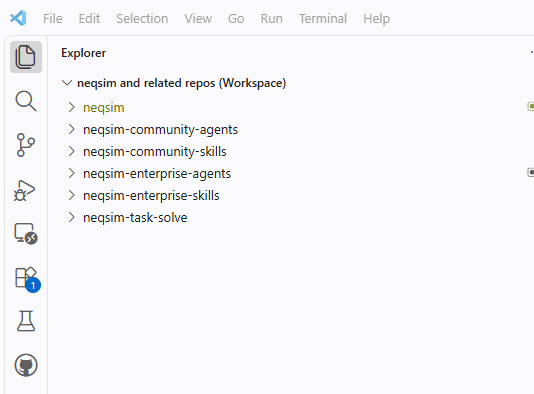

# Installation Guide — Agentic AI with NeqSim (Community)

This guide gets you from a fresh machine to running the public **NeqSim community
agents and skills** (thermodynamics, process simulation, flow assurance, field
development, energy systems) inside VS Code with GitHub Copilot.

Human review is always required for engineering conclusions. Agents help you
screen, organize, calculate, and draft — they do not replace engineering judgement.

---

## 1. What you are installing

Community agents and skills build on the NeqSim library and live in three public
repositories:

| Repository | What it holds |
|------------|---------------|
| [equinor/neqsim](https://github.com/equinor/neqsim) | **NeqSim library + code repo.** Contains the `neqsim` CLI installer. |
| [equinor/neqsim-community-agents](https://github.com/equinor/neqsim-community-agents) | **Community agents** — reusable engineering assistants. |
| [equinor/neqsim-community-skills](https://github.com/equinor/neqsim-community-skills) | **Community skills** — reusable engineering methods. |

**Dependency direction:** `NeqSim core → core skills → community skills → community agents`.
Higher layers may use lower ones; never the reverse.

> **Enterprise use:** companies can build their own private **enterprise agent and
> skill pages** on top of these public repositories — adding organization-specific
> integrations, data sources, and governance — while reusing every community skill
> and agent. Keep company-specific detail in those private repositories and keep
> community content generic and plant-agnostic. See the
> [Enterprise Agent and Skill Repositories guide](https://github.com/equinor/neqsim/blob/master/docs/integration/enterprise_agent_skill_repos.md).

---

## 2. Prerequisites

Install these tools (the ones referenced in the *Tools used in this workflow* slide):

- **GitHub account.**
- **GitHub Copilot** subscription.
- **[Visual Studio Code](https://code.visualstudio.com/)** with the **GitHub
  Copilot** and **GitHub Copilot Chat** extensions.
  - Cloud alternative: **GitHub Codespaces** (no local install needed).
- When working locally, also install:
  - **[Git](https://git-scm.com/downloads)**
  - **[Python 3.8+](https://www.python.org/downloads/)** (check *Add python.exe to PATH*)
  - **[Java (JDK)](https://adoptium.net/)** — required for NeqSim calculations and builds

You do **not** need to install Maven separately. The NeqSim repository includes
the Maven Wrapper (`mvnw` / `mvnw.cmd`).

> **Tip:** A Python virtual environment keeps the CLI isolated and avoids most
> PATH problems. The commands below create one inside the cloned repository.

---

## 3. Install (Windows, VS Code terminal)

Run these from a VS Code PowerShell terminal. If PowerShell blocks activation,
use the `cmd.exe` fallback in Troubleshooting.

### 3.1 Clone NeqSim and run the installer

```powershell
git clone https://github.com/equinor/neqsim
cd neqsim
py -3 -m venv .venv
.\.venv\Scripts\Activate.ps1
.\install.ps1
```

Run `.\install.ps1` **from PowerShell**: it runs in your current session, so
`neqsim` works in the window you are already in. If your execution policy blocks
scripts, use the pure-batch `.\install.cmd` instead — launched from PowerShell it
runs as a child process and cannot update your session, so you then need a new
terminal. Either one finds a working Python, installs the NeqSim **devtools**
package, puts the `neqsim` command on your PATH, and then checks whether it
actually resolves and tells you which form to use.

Keep this virtual environment active and verify the CLI in the same terminal
(`--skip-jar` because the Java library is not built yet):

```powershell
neqsim --help
neqsim doctor --skip-jar
```

That should report *"All checks passed! Environment is ready."* Without
`--skip-jar` the doctor also requires a built JAR, which fails on a fresh clone —
that is expected, not a broken install. If `neqsim` is not found, use
`python -m neqsim_cli --help` from the activated environment and see
Troubleshooting; the doctor's **CLI command** check names the cause.

> **`neqsim` not recognized? Use `python -m neqsim_cli` instead.**
> Without administrator rights the console script frequently does not land on
> PATH. That is not a failed install — just replace `neqsim` with
> `python -m neqsim_cli` (`python3 -m neqsim_cli` on macOS/Linux) in **every**
> command in this guide; the arguments are identical. The whole setup then reads:
>
> ```powershell
> python -m neqsim_cli doctor
> python -m neqsim_cli agent install --all --source community --vscode --force
> python -m neqsim_cli agent doctor --target vscode --source community
> ```
>
> Run it from the same activated environment you installed into, so each skill's
> Python package is installed for that interpreter.

### 3.2 Install the community agents into VS Code

The public community catalog requires no login or private catalog registration.
Select it explicitly so previously registered private catalogs cannot affect this
public installation:

```powershell
neqsim agent install --all --source community --vscode --force
```

- `--all --source community` installs all agents in the public community catalog.
- `--vscode` exports them so they appear in **GitHub Copilot Chat**.
- Installing an agent **automatically installs the skills** it declares in
  `required_skills` — so a separate skill-install step is not needed for the
  agent workflow.
- `--force` reinstalls each agent **and** each required skill from the catalog
  (not just re-exporting the existing copy), then re-exports both — safe to
  re-run after a catalog update.

Browse and install individually:

```powershell
neqsim agent list                       # list available community agents
neqsim skill list                       # list available community skills
neqsim agent install <name> --vscode    # install a single agent
neqsim skill install <name> --vscode    # install a single skill (standalone)
```

Verify the exported agents and their required skills:

```powershell
neqsim agent doctor --target vscode --source community
```

Success means the install command exits with code `0` and doctor reports
`Result: PASS`. Do not use a fixed expected agent count: the public catalog grows
over time.

### 3.3 Open the repos (and your task folder) in one VS Code workspace

Agents are installed per user, so they are available in any window — but the work
is much easier when the repos and your task folder are open together, because
Copilot Chat can then read a skill, the agent definition, the NeqSim source, and
the task you are solving in the same conversation.

Clone the repos into one parent folder, open the first with **File → Open
Folder...**, add the rest with **File → Add Folder to Workspace...**, then
**File → Save Workspace As...** → `neqsim-and-related-repos.code-workspace`:

```powershell
cd "$env:USERPROFILE\Documents\GitHub"
git clone https://github.com/equinor/neqsim.git
git clone https://github.com/equinor/neqsim-community-agents.git
git clone https://github.com/equinor/neqsim-community-skills.git
```



*Figure — one workspace, the repos plus your task folder. (The screenshot also
shows the two Equinor-internal repos; on the public side you have the three
above.)*

Or write the workspace file yourself and open it:

```json
{
  "folders": [
    { "path": "neqsim" },
    { "path": "neqsim-community-agents" },
    { "path": "neqsim-community-skills" },
    { "name": "neqsim-task-solve", "path": "C:\\Users\\<user>\\neqsim-task-solve" }
  ],
  "settings": {}
}
```

**The task folder is deliberately not a clone.** Task output — evidence,
notebooks, results, reports — must never be written into a code repository.
Register it once, then add that same folder to the workspace so new tasks appear
in the Explorer immediately:

```powershell
neqsim --set-task-root "C:\Users\<user>\neqsim-task-solve"
neqsim --show-task-root
```

Relative paths in the workspace file resolve from the folder holding it; the task
folder uses an absolute path because it lives outside the code folder. Only add
folders you actually work in — unrelated folders make agent answers noisier.

---

## 4. macOS / Linux equivalents

```bash
git clone https://github.com/equinor/neqsim
cd neqsim
python3 -m venv .venv
source .venv/bin/activate
./install.sh

neqsim doctor --skip-jar
neqsim agent install --all --source community --vscode --force
neqsim agent doctor --target vscode --source community
```

If the `neqsim` command is not found, prefix each of the last three commands with
`python3 -m neqsim_cli` instead — same arguments.

---

## 5. Use the agents in VS Code

1. Open the **Copilot Chat** panel in VS Code.
2. Type `@` to see installed agents, or reference one directly, for example:
  - `@pvt-agent` — fluid characterization and phase-behavior guidance
  - `@process-engineer-agent` — early process-engineering screening
  - `@flow-assurance-engineer-agent` — hydrate and wax margin screening
  - `@process-safety-agent` — relief and depressurization screening
  - `@asset-economics-agent` — concept-level cost and value screening
3. Describe your task in plain language. The agent selects the right skills,
   runs NeqSim calculations, and produces a draft for your review.

For agentic task-solving (task folders, notebooks, reports), the NeqSim code repo
provides the full workflow — see `AGENTS.md` and
`docs/development/TASK_SOLVING_GUIDE.md` in the cloned repo. Workspace-local core
agents such as `@solve.task` are available when that NeqSim workspace is open;
they are distinct from the globally exported community agents listed above.

### 5.1 Push back what the task taught you

Solving a task is also a test of NeqSim, the agents, and the skills:


Whenever a task needed a workaround, a rediscovery, or repeated trial and error
that a class, agent, or skill *should* have handled, fix it and **push it** — the
loop only closes when the fix leaves your machine:

| What you learned | Repo | Change |
|------------------|------|--------|
| Missing or wrong calculation, equipment, property | `equinor/neqsim` | Java + JUnit test, `mvnw spotless:apply`, PR |
| Wrong API recipe, gotcha, unit trap, better pattern | `neqsim-community-skills` | edit the `SKILL.md` |
| Wrong skill choice, missed hand-off, bad routing | `neqsim-community-agents` | edit the `*.agent.md` |
| Useful new multi-agent pipeline | `neqsim-community-agents` | record it as a composition pattern |

Each folder in the workspace is its own repository, so commit in the one you
changed, then refresh your install:

```powershell
cd "$env:USERPROFILE\Documents\GitHub\neqsim-community-skills"
git checkout -b task/<slug>
git add skills/<skill-name>/SKILL.md
git commit -m "<what the task taught>"
git push -u origin task/<slug>
gh pr create --fill

neqsim agent install --all --source community --vscode --force
```

Never commit task output (evidence, notebooks, results, reports) or any
company-specific data into these public repos — only the reusable, plant-agnostic
distillation. See [contribution-guide.md](contribution-guide.md) for review
expectations.

---

## 6. Keeping up to date

```powershell
cd neqsim
git pull
.\install.ps1                       # refresh devtools if updated
neqsim agent install --all --source community --vscode --force
neqsim agent doctor --target vscode --source community
```

---

## 7. Troubleshooting

| Symptom | Fix |
|---------|-----|
| `neqsim` not recognized in VS Code terminal | Activate `.venv` and retry. If you installed outside a virtual environment, fully **quit and reopen VS Code** because PATH is captured at launch. You can always use `python -m neqsim_cli ...`. |
| `install.cmd` can't find Python | Install Python 3.8+ and check *Add python.exe to PATH*, then re-run. |
| PowerShell blocks `.venv` activation | Open `cmd.exe`, run `.venv\Scripts\activate.bat`, then run `install.cmd`. The installer itself is pure batch. |
| Agent install exits with code `1` | Read the final `Failed agents:` line. Re-run with `--source community` to exclude registered private catalogs, then resolve any named community failure. |
| Agents not visible in Copilot | Re-run `neqsim agent install --all --source community --vscode --force`, run `neqsim agent doctor --target vscode --source community`, then use **Developer: Reload Window** in VS Code. |
| A skill's Python package is not importable | Run `neqsim skill doctor --target vscode` — it reports how many packaged skills are importable and names the rest. Fix all with `neqsim skill sync-packages`, or one with `neqsim skill ensure <name>`. |
| Reinstalling everything is slow | A refresh only re-runs pip for a skill whose `pyproject.toml` changed, so repeat `--force` runs are cheap. For a cold install you can add `--no-pip` and run `neqsim skill sync-packages` afterwards. |
| Installation and export locations | Internal packages live under `~/.neqsim/`. VS Code user exports live under `~/.copilot/agents/` and `~/.copilot/skills/` (`%USERPROFILE%` on Windows). |

---

## 8. Governance & safety

- Agents orchestrate approved **skills**; engineering methods live in skills, not
  in agent definitions.
- Keep community content generic and plant-agnostic; company-specific detail
  belongs in private enterprise repositories.
- All engineering conclusions, and any decision affecting assets, people,
  environment, or production, **require human review**.

---

## 9. References

- NeqSim library & code repo — <https://github.com/equinor/neqsim>
- Community agents — <https://github.com/equinor/neqsim-community-agents>
- Community skills — <https://github.com/equinor/neqsim-community-skills>
- Enterprise agent & skill repositories guide — <https://github.com/equinor/neqsim/blob/master/docs/integration/enterprise_agent_skill_repos.md>
